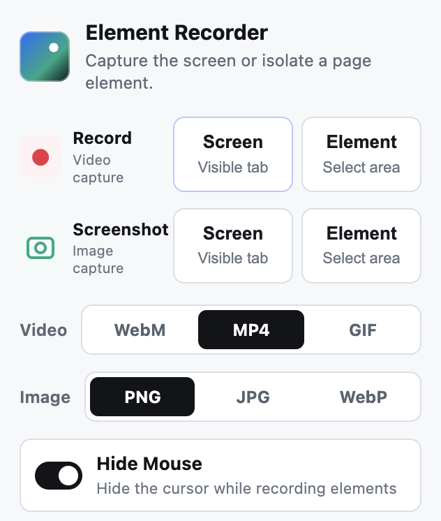
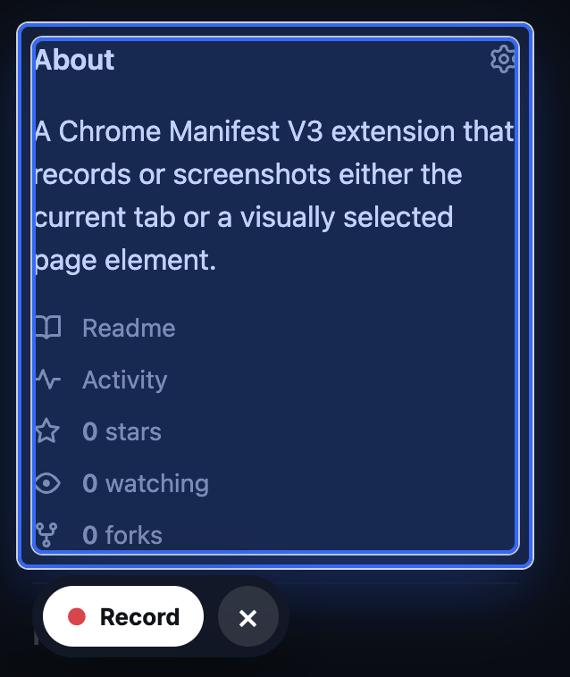

# Element Recorder

A Chrome Manifest V3 extension for recording or screenshotting the active tab, including visually selected page elements.

## Features

- Record the active tab as WebM, MP4, or GIF.
- Screenshot the active tab as PNG, JPG, or WebP.
- Select a page element visually and capture only that element.
- Hide the cursor during element recordings, enabled by default.
- Save generated files locally under `Element Recorder/` in Downloads.

## Demo

| Popup controls | Element selection |
| --- | --- |
|  |  |

## Local Development

```bash
npm install
npm run build
```

Load the built extension from `dist/`:

1. Open `chrome://extensions`.
2. Enable Developer Mode.
3. Click Load unpacked.
4. Select the `dist/` folder.

## Checks

```bash
npm run check
```

## How It Works

- Screen recording uses Chrome tab capture and `MediaRecorder`.
- Element mode never renders or captures DOM directly. It keeps the page intact, draws a four-rectangle dimming overlay with a transparent hole over the selected element, then records the native display stream.
- Element recordings hide the cursor by default. The popup option can turn cursor hiding off.
- Screenshots can be saved as PNG, JPG, or WebP files. Element screenshots crop the visible tab capture to the selected element.
- Generated files are auto-downloaded under `Element Recorder/`.

## Privacy

Element Recorder processes captures locally in Chrome and does not send recordings, screenshots, browsing history, page contents, or settings to any server. See [PRIVACY.md](PRIVACY.md).
